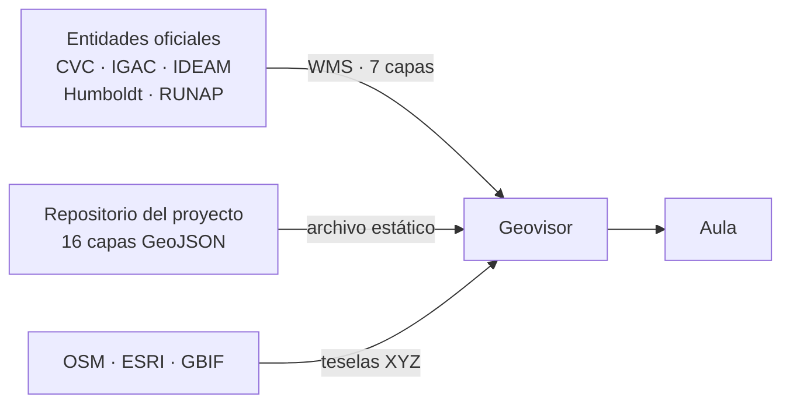
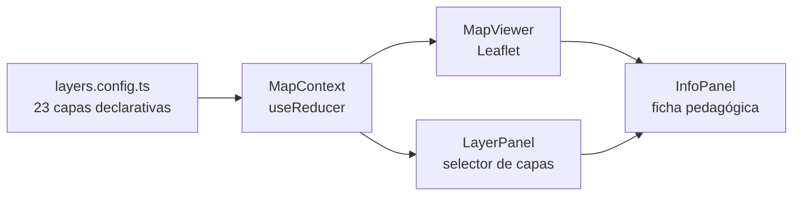
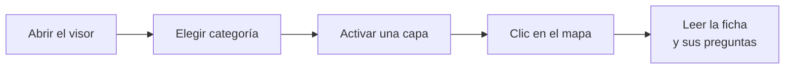
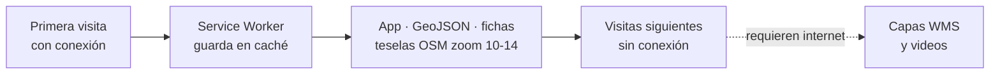

# Geovisor Ecopedagógico — Sevilla, Valle del Cauca

> A static web GIS application for exploring the socio-ecosystemic transformations of Sevilla municipality through interactive geographic layers, pedagogical sheets, and guided tours.

**Bachelor's Thesis — Systems Engineering · Universidad Santiago de Cali**  
Cristóbal Valencia Cerón · José David Molina Delgado  
Advisor: Diego Fernando Loaiza · Research Group INFORMA

---

## Overview

The Geovisor Ecopedagógico is a 100% client-side SPA (JAMstack) — no backend, no database, no server-side logic. All geographic data is consumed directly from public WMS/WFS geoservices (CVC, IGAC, IDEAM) or shipped as static GeoJSON files versioned in this repository. The application is designed as a didactic tool for secondary school students (ages 10–15) in Sevilla, Valle del Cauca, following the ecopedagogical framework of Zimmermann (2005).

**Reference portal:** [Portal GeoCVC](https://geo.cvc.gov.co) — the technical and functional benchmark for this project.

---

## At a Glance

| | |
|---|---|
| **What it is** | A didactic web GIS for the municipality of Sevilla, Valle del Cauca |
| **Who it is for** | Secondary school students (10–15), teachers, general public |
| **Content** | 23 geographic layers · 6 categories · 23 pedagogical sheets · 4 guided tours |
| **Architecture** | JAMstack SPA — no backend, no database, no personal data |
| **Data** | 7 live WMS services + 16 GeoJSON layers versioned in this repo |
| **Offline** | Service Worker pre-caches app, data and OSM tiles (zoom 10–14, ~50 MB) |

---

## How It Works

Four separate views, each answering one question.

**1. Where does the data come from?**



**2. How is the application put together?**



**3. What does a student actually do?**



**4. How does it work without internet?**



---

## Documentation

Two companion manuals live in [`docs/`](./docs), each in Word and PDF. They follow APA 7
formatting and are diagram-led: 21 rendered Mermaid figures carry most of the explanation.

| Document | Word | PDF |
|----------|------|-----|
| **Manual de Usuario** — step-by-step guide for students, teachers and general public (12 pp., 9 figures) | [`.docx`](./docs/Manual%20de%20Usuario%20-%20Geovisor%20Ecopedagogico.docx) | [`.pdf`](./docs/Manual%20de%20Usuario%20-%20Geovisor%20Ecopedagogico.pdf) |
| **Manual Técnico** — architecture, components, data model, deployment, RF tables (17 pp., 12 figures) | [`.docx`](./docs/Manual%20Tecnico%20-%20Geovisor%20Ecopedagogico.docx) | [`.pdf`](./docs/Manual%20Tecnico%20-%20Geovisor%20Ecopedagogico.pdf) |

Both are **generated, not hand-edited** — the sources live in
[`docs/generador/`](./docs/generador) so the deliverable and its source stay in sync with
the code. See that folder's README to regenerate them.

See also the original [Requirements Document v2.0](./Documento%20de%20Requerimientos%20v2%20-%20Geovisor%20Ecopedag%C3%B3gico.pdf).

---

## Tech Stack

| Layer | Technology | Version |
|-------|-----------|---------|
| UI framework | React | 18.x |
| Language | TypeScript | 5.x |
| Build tool | Vite | 5.x |
| Map engine | Leaflet.js + React-Leaflet | 1.9 / 4.x |
| Styling | Tailwind CSS | 3.x |
| Routing | React Router | 6.x |
| Offline / PWA | Workbox (vite-plugin-pwa) | 7.x |
| UI primitives | Radix UI | 1.x |
| Deployment | Vercel | — |

---

## Getting Started

### Prerequisites

- Node.js ≥ 18
- npm ≥ 9

### Local development

```bash
# Install dependencies
npm install

# Start dev server with hot reload
npm run dev
# → http://localhost:5173/
```

### Production build

```bash
# Compile and bundle for production
npm run build        # output → dist/

# Preview the production build locally
npm run preview      # → http://localhost:4173/
```

### Deployment

Deployment is handled by **Vercel**, connected to this repository. Every push to `Master` triggers a build and publishes it automatically — no workflow files and no manual steps.

`vercel.json` rewrites every route to `index.html`, which is what a client-side router needs so that deep links such as `/visor?recorrido=huellas_cafe` resolve correctly.

> **Note on `base`:** `vite.config.ts` sets `base: '/'` and the app fetches its data with absolute paths (`fetch('/data/...')`). Both assume the site is served from a domain root, which is exactly what Vercel provides. Serving it from a subpath instead would require changing `base` and prefixing those fetches with `import.meta.env.BASE_URL`.

---

## Project Structure

```
geovisor-sevillavalle/
│
├── public/
│   ├── data/                    # Static GeoJSON files (versioned, ≤ 2 MB each)
│   │   ├── actores/             # Social actors per ecosystem
│   │   ├── agua/                # River basins, wetlands, monitoring points
│   │   ├── biodiversidad/       # Páramos, species records, protected areas
│   │   ├── clima/               # Hydroclimatological stations
│   │   ├── recorridos/          # Guided tour definitions (one JSON per tour)
│   │   └── territorio/          # Administrative boundaries, PCC, resguardos
│   ├── fichas/                  # Pedagogical sheet content (JSON, one per layer)
│   └── icons/                   # PWA icons (192 / 512 px)
│
├── src/
│   ├── components/
│   │   ├── MapViewer.tsx        # Leaflet map container (GeoJSON + WMS rendering)
│   │   ├── LayerPanel.tsx       # Collapsible accordion layer selector
│   │   ├── InfoPanel.tsx        # Slide-in pedagogical sheet panel
│   │   ├── MapToolbar.tsx       # Base map selector, measure, export, search
│   │   ├── FeatureSearchPanel.tsx # Attribute search across active layers (RF-09)
│   │   ├── RecorridoHUD.tsx     # Guided tour stop navigation (RF-14)
│   │   ├── Navbar.tsx           # Top navigation bar + Nominatim geocoder
│   │   └── Footer.tsx           # Attribution footer
│   ├── pages/
│   │   ├── Home.tsx             # Landing page with territory context
│   │   ├── Visor.tsx            # Main map interface (CU-01, CU-02)
│   │   ├── Recorridos.tsx       # Guided thematic tours (RF-14)
│   │   ├── Glosario.tsx         # Searchable ecopedagogical glossary (RF-16)
│   │   ├── Guia.tsx             # Usage instructions
│   │   ├── Creditos.tsx         # Credits and data attributions
│   │   └── Privacidad.tsx       # Privacy notice (Ley 1581 de 2012)
│   ├── config/
│   │   └── layers.config.ts     # Single source of truth for all 23 map layers
│   ├── context/
│   │   └── MapContext.tsx       # Global map state (useReducer + Context API)
│   ├── hooks/
│   │   ├── useMapLayers.ts      # Layer access + toggle helpers
│   │   ├── useMediaQuery.ts     # Responsive breakpoint detection
│   │   ├── useUrlSync.ts        # Serializes map state into query params (RF-18)
│   │   └── useOffline.ts        # Online/offline status tracker
│   ├── sw.ts                    # Service Worker (Workbox injectManifest)
│   └── types/
│       └── index.ts             # All domain TypeScript interfaces
│
├── docs/                        # User and technical manuals (.docx + .pdf)
│   └── generador/               # Scripts and Mermaid sources that build them
│
├── vercel.json                  # SPA rewrites (all routes → index.html)
├── vite.config.ts               # Vite + PWA (Workbox) configuration
├── tailwind.config.js           # Custom design system (ecopedagogical palette)
└── tsconfig.app.json            # TypeScript compiler options (ES2022 strict)
```

---

## Geographic Layers

All 23 layers are defined in [`src/config/layers.config.ts`](src/config/layers.config.ts). Adding or modifying a layer requires only editing that file — no component changes needed.

| Category | Layers | Data type |
|----------|--------|-----------|
| Actores Sociales | Humedales, Páramo, Bosque Andino, Bosque Seco | GeoJSON static |
| Agua | Cuencas, Red Hídrica, Humedales, Calidad Agua, Monitoreo Subterráneo, Predios Art.111 | GeoJSON + WMS |
| Biodiversidad | Cobertura 50K, Ecosistemas, Páramos, Especies, Áreas Protegidas, Zonificación Forestal | GeoJSON + WMS |
| Cambio Climático | Isoyetas, Estaciones Hidroclimatológicas, Pisos Térmicos | GeoJSON + WMS |
| Suelos | Conflictos de Uso 50K | WMS |
| Territorio | División Administrativa, Resguardos Indígenas, PCC UNESCO | GeoJSON + WMS |

---

## Data Sources

| Institution | Service type | Endpoint |
|------------|-------------|----------|
| CVC — Portal GeoCVC | WMS | `geoservicios.cvc.gov.co/geoserver/wms` |
| IGAC — Geoservicios | WMS | `geoportal.igac.gov.co/server/services/.../WMSServer` |
| IDEAM — Hidroclimatología | WMS | `geoserver.ideam.gov.co/geoserver/ows` |
| IAvH — Páramos | WMS | `geoservicios.humboldt.org.co/geoserver/wms` |
| RUNAP — Áreas Protegidas | WMS | `runap.parquesnacionales.gov.co/geoserver/wms` |
| GBIF / SiB Colombia | XYZ tiles | `api.gbif.org/v2/map/occurrence/density/{z}/{x}/{y}` |
| OpenStreetMap | XYZ tiles | `tile.openstreetmap.org/{z}/{x}/{y}.png` |
| ESRI World Imagery | XYZ tiles | `server.arcgisonline.com/.../MapServer/tile/{z}/{y}/{x}` |

---

## Pedagogical Sheets

Each layer has an associated JSON file in `public/fichas/{layerId}.json` following the `FichaPedagogica` schema:

```jsonc
{
  "id": "agua_cuencas",
  "titulo": "Cuencas Hidrográficas de Sevilla",
  "categoria": "agua",
  "descripcion": "...",
  "importancia": "...",
  "preguntas_reflexivas": ["...", "..."],   // 3–5 reflection questions
  "vocabulario": [{ "termino": "...", "definicion": "..." }],
  "galeria": [{ "url": "...", "titulo": "...", "credito": "..." }],
  "videos": [{ "youtube_id": "...", "titulo": "..." }],
  "fuente_datos": "IDEAM / CVC — Servicio WMS público",
  "nivel_educativo": "Básica secundaria (grados 6–9)"
}
```

---

## Offline Support

After the first online visit, the PWA Service Worker (Workbox) caches:
- All JS/CSS/HTML application files
- All GeoJSON static layers
- OSM map tiles for zoom levels 10–14 over Sevilla's bounding box `[-76.08, 4.10, -75.78, 4.44]` (~50 MB)

WMS layers (raster) are not available offline — the UI shows a clear warning when a WMS layer cannot be loaded.

---

## Non-Functional Targets (from Requirements v2.0)

| Metric | Target | Status |
|--------|--------|--------|
| JS bundle (gzip) | < 500 KB | ✅ 111 KB |
| First Contentful Paint | < 1.5 s @ 10 Mbps | Pending Lighthouse audit |
| Largest Contentful Paint | < 2.5 s (Core Web Vitals Good) | Pending Lighthouse audit |
| WCAG compliance | Level AA | In progress |
| GeoJSON file size | < 2 MB each | ✅ All seed files < 10 KB |
| Offline tile cache | Zoom 10–14, ~50 MB | ✅ Configured in Workbox |

---

## Roadmap

- [ ] **v1.1** — Real GeoJSON data collection from CVC/IGAC field surveys
- [ ] **v1.2** — Guided tour navigation with `flyTo` animation and step narration (RF-14)
- [ ] **v1.3** — URL-based map state sharing via query params (RF-18)
- [ ] **v1.4** — Export map view as PNG (RF-17)
- [ ] **v1.5** — Historical timeline slider for land cover change (RF-15)
- [ ] **v2.0** — i18n support (Spanish + indigenous language)

---

## License

Academic project — Universidad Santiago de Cali, 2026.  
Geographic data sources retain their original licenses (CVC, IGAC, IDEAM, GBIF open data).  
Imagery: Creative Commons (Wikimedia Commons), NASA Worldview (public domain), ESA Copernicus (free for educational use).
