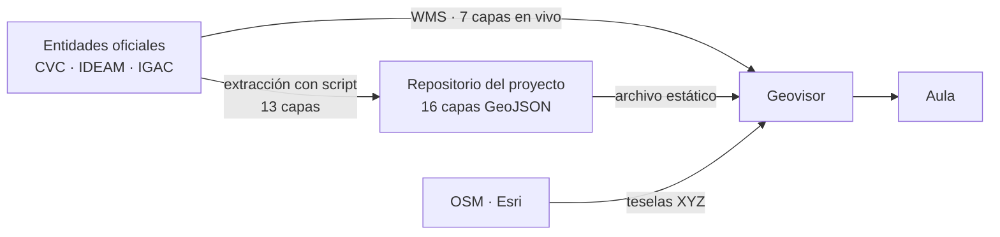
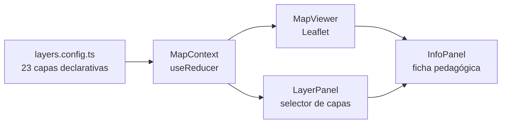
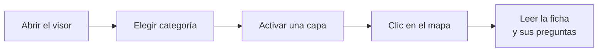
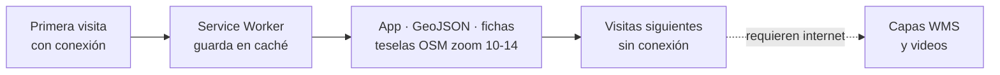

# Geovisor Ecopedagógico — Sevilla, Valle del Cauca

> A static web GIS application for exploring the socio-ecosystemic transformations of Sevilla municipality through interactive geographic layers, pedagogical sheets, and guided tours.

**Bachelor's Thesis — Systems Engineering · Universidad Santiago de Cali**  
Cristóbal Valencia Cerón · José David Molina Delgado  
Advisors: Diego Fernando Loaiza · Silvia Andrea Quijano Pérez · Research Group COMBA I+D  
Partner thesis (ecopedagogical content): *Cartografiar las huellas del café*, Jonathan Rodríguez Camacho

---

## Overview

The Geovisor Ecopedagógico is a 100% client-side SPA (JAMstack) — no backend, no database, no server-side logic. Geographic data comes from two places: 7 raster layers are requested live from official WMS services (CVC, IDEAM, IGAC), and 16 vector layers ship as static GeoJSON files versioned in this repository. 13 of them are extracts of official CVC services clipped to Sevilla; the other 3 are illustrative and labelled as such in the UI (see [Data provenance](#data-provenance)). The application is designed as a didactic tool for secondary school students (ages 10–15) in Sevilla, Valle del Cauca, following the ecopedagogical framework of Zimmermann (2005).

**Reference portal:** [Portal GeoCVC](https://portal-geo.cvc.gov.co) — the technical and functional benchmark for this project. (Its former address, `geo.cvc.gov.co`, no longer resolves.)

---

## At a Glance

| | |
|---|---|
| **What it is** | A didactic web GIS for the municipality of Sevilla, Valle del Cauca |
| **Who it is for** | Secondary school students (10–15), teachers, general public |
| **Content** | 23 geographic layers · 6 categories · 23 pedagogical sheets · 4 guided tours |
| **Architecture** | JAMstack SPA — no backend, no database, no personal data |
| **Data** | 7 live WMS layers (CVC 4 · IDEAM 2 · IGAC 1) + 16 GeoJSON layers (13 official CVC extracts · 3 illustrative) |
| **Offline** | Service Worker pre-caches app, data and OSM tiles (zoom 10–14, 571 tiles, ~11 MB) |

---

## How It Works

Four separate views, each answering one question.

**1. Where does the data come from?**


```mermaid
flowchart LR
    A["Entidades oficiales<br/>CVC · IDEAM · IGAC"] -->|"WMS · 7 capas en vivo"| V["Geovisor"]
    A -->|"extracción con script<br/>13 capas"| B["Repositorio del proyecto<br/>16 capas GeoJSON"]
    B -->|"archivo estático"| V
    C["OSM · Esri"] -->|"teselas XYZ"| V
    V --> D["Aula"]
```

**2. How is the application put together?**


```mermaid
flowchart LR
    A["layers.config.ts<br/>23 capas declarativas"] --> B["MapContext<br/>useReducer"]
    B --> C["MapViewer<br/>Leaflet"]
    B --> D["LayerPanel<br/>selector de capas"]
    C --> E["InfoPanel<br/>ficha pedagógica"]
    D --> E
```

**3. What does a student actually do?**


```mermaid
flowchart LR
    A["Abrir el visor"] --> B["Elegir categoría"]
    B --> C["Activar una capa"]
    C --> D["Clic en el mapa"]
    D --> E["Leer la ficha<br/>y sus preguntas"]
```

**4. How does it work without internet?**


```mermaid
flowchart LR
    A["Primera visita<br/>con conexión"] --> B["Service Worker<br/>guarda en caché"]
    B --> C["App · GeoJSON · fichas<br/>teselas OSM zoom 10-14"]
    C --> D["Visitas siguientes<br/>sin conexión"]
    D -.->|"requieren internet"| E["Capas WMS<br/>y videos"]
```

---

## Documentation

Two companion manuals live in [`docs/`](./docs), each in Word and PDF. They follow APA 7
formatting and are diagram-led: 21 rendered Mermaid figures carry most of the explanation.

| Document | Word | PDF |
|----------|------|-----|
| **Manual de Usuario** — step-by-step guide for students, teachers and general public (12 pp., 9 figures) | [`.docx`](./docs/Manual%20de%20Usuario%20-%20Geovisor%20Ecopedagogico.docx) | [`.pdf`](./docs/Manual%20de%20Usuario%20-%20Geovisor%20Ecopedagogico.pdf) |
| **Manual Técnico** — architecture, components, data model, deployment, RF tables (18 pp., 12 figures) | [`.docx`](./docs/Manual%20Tecnico%20-%20Geovisor%20Ecopedagogico.docx) | [`.pdf`](./docs/Manual%20Tecnico%20-%20Geovisor%20Ecopedagogico.pdf) |

Both are **generated, not hand-edited** — the sources live in
[`docs/generador/`](./docs/generador) so the deliverable and its source stay in sync with
the code. See that folder's README to regenerate them.

See also the original [Requirements Document v2.0](./Documento%20de%20Requerimientos%20v2%20-%20Geovisor%20Ecopedag%C3%B3gico.pdf).

---

## Tech Stack

| Layer | Technology | Version |
|-------|-----------|---------|
| UI framework | React | 18.x |
| Language | TypeScript | 5.x |
| Build tool | Vite | 5.x |
| Map engine | Leaflet.js + React-Leaflet | 1.9 / 4.x |
| Styling | Tailwind CSS | 3.x |
| Routing | React Router | 6.x |
| Offline / PWA | Workbox (vite-plugin-pwa) | 7.x |
| UI primitives | Radix UI | 1.x |
| Deployment | Vercel | — |

---

## Getting Started

### Prerequisites

- Node.js ≥ 18
- npm ≥ 9

### Local development

```bash
# Install dependencies
npm install

# Start dev server with hot reload
npm run dev
# → http://localhost:5173/
```

### Production build

```bash
# Compile and bundle for production
npm run build        # output → dist/

# Preview the production build locally
npm run preview      # → http://localhost:4173/
```

### Deployment

Deployment is handled by **Vercel**, connected to this repository. Every push to `Master` triggers a build and publishes it automatically — no workflow files and no manual steps.

`vercel.json` rewrites every route to `index.html`, which is what a client-side router needs so that deep links such as `/visor?recorrido=huellas_cafe` resolve correctly.

> **Note on `base`:** `vite.config.ts` sets `base: '/'` and the app fetches its data with absolute paths (`fetch('/data/...')`). Both assume the site is served from a domain root, which is exactly what Vercel provides. Serving it from a subpath instead would require changing `base` and prefixing those fetches with `import.meta.env.BASE_URL`.

---

## Project Structure

```
geovisor-sevillavalle/
│
├── public/
│   ├── data/                    # Static GeoJSON (13 official CVC extracts + 3 illustrative, ≤ 2 MB each)
│   │   ├── actores/             # Social actors per ecosystem
│   │   ├── agua/                # River basins, wetlands, monitoring points
│   │   ├── biodiversidad/       # Páramos, species records, protected areas
│   │   ├── clima/               # Hydroclimatological stations
│   │   ├── recorridos/          # Guided tour definitions (one JSON per tour)
│   │   └── territorio/          # Administrative boundaries, PCC, resguardos
│   ├── fichas/                  # Pedagogical sheet content (JSON, one per layer)
│   └── icons/                   # PWA icons (192 / 512 px)
│
├── src/
│   ├── components/
│   │   ├── MapViewer.tsx        # Leaflet map container (GeoJSON + WMS rendering)
│   │   ├── LayerPanel.tsx       # Collapsible accordion layer selector
│   │   ├── InfoPanel.tsx        # Slide-in pedagogical sheet panel
│   │   ├── MapToolbar.tsx       # Base map selector, measure, export, search
│   │   ├── FeatureSearchPanel.tsx # Attribute search across active layers (RF-09)
│   │   ├── RecorridoHUD.tsx     # Guided tour stop navigation (RF-14)
│   │   ├── Navbar.tsx           # Top navigation bar + Nominatim geocoder
│   │   └── Footer.tsx           # Attribution footer
│   ├── pages/
│   │   ├── Home.tsx             # Landing page with territory context
│   │   ├── Visor.tsx            # Main map interface (CU-01, CU-02)
│   │   ├── Recorridos.tsx       # Guided thematic tours (RF-14)
│   │   ├── Glosario.tsx         # Searchable ecopedagogical glossary (RF-16)
│   │   ├── Guia.tsx             # Usage instructions
│   │   ├── Creditos.tsx         # Credits and data attributions
│   │   └── Privacidad.tsx       # Privacy notice (Ley 1581 de 2012)
│   ├── config/
│   │   └── layers.config.ts     # Single source of truth for all 23 map layers
│   ├── context/
│   │   └── MapContext.tsx       # Global map state (useReducer + Context API)
│   ├── hooks/
│   │   ├── useMapLayers.ts      # Layer access + toggle helpers
│   │   ├── useMediaQuery.ts     # Responsive breakpoint detection
│   │   ├── useUrlSync.ts        # Serializes map state into query params (RF-18)
│   │   └── useOffline.ts        # Online/offline status tracker
│   ├── sw.ts                    # Service Worker (Workbox injectManifest)
│   └── types/
│       └── index.ts             # All domain TypeScript interfaces
│
├── docs/                        # User and technical manuals (.docx + .pdf)
│   └── generador/               # Scripts and Mermaid sources that build them
│
├── scripts/
│   └── datos/                   # build_capas_oficiales.py — rebuilds the 13 official GeoJSON from CVC
│
├── vercel.json                  # SPA rewrites (all routes → index.html)
├── vite.config.ts               # Vite + PWA (Workbox) configuration
├── tailwind.config.js           # Custom design system (ecopedagogical palette)
└── tsconfig.app.json            # TypeScript compiler options (ES2022 strict)
```

---

## Geographic Layers

All 23 layers are defined in [`src/config/layers.config.ts`](src/config/layers.config.ts). Adding or modifying a layer requires only editing that file — no component changes needed. Every layer declares its `fuente` (producing entity, dataset, link and an `ilustrativo` flag), which the UI shows in the layer panel, the popup and the pedagogical sheet.

| Category | Layers | Data type |
|----------|--------|-----------|
| Actores Sociales | Humedales\*, Páramo\*, Bosque Andino, Bosque Seco\* | GeoJSON |
| Agua | Cuencas, Red Hídrica, Humedales, Calidad Agua, Monitoreo Subterráneo, Predios Art.111 | GeoJSON + WMS |
| Biodiversidad | Cobertura de la Tierra 2024, Ecosistemas, Páramos, Especies, Áreas Protegidas, Zonificación Forestal | GeoJSON + WMS |
| Cambio Climático | Isoyetas, Estaciones Hidroclimatológicas, Pisos Térmicos | GeoJSON + WMS |
| Suelos | Conflictos de Uso del Suelo | WMS |
| Territorio | División Político-Administrativa, Resguardos Indígenas, PCC UNESCO | GeoJSON |

\* Illustrative layers (see [Data provenance](#data-provenance)).

---

## Data Sources

**Live WMS layers** — verified on 2026-10-05; every service answers `GetMap` over Sevilla in EPSG:3857.

| Layer | Institution | Endpoint (`…/MapServer/WMSServer`) | WMS layer |
|-------|-------------|------------------------------------|-----------|
| Red Hídrica | CVC — Portal GeoCVC | `portal-geo.cvc.gov.co/server/services/Agua/Red_Hidrica` | `0,1,2` |
| Ecosistemas | CVC — Portal GeoCVC | `portal-geo.cvc.gov.co/server/services/Biodiversidad/Ecosistemas` | `1` |
| Zonificación Forestal | CVC — Portal GeoCVC | `portal-geo.cvc.gov.co/server/services/Biodiversidad/Uso_Potencial__Zonificacion_Forestal` | `0` |
| Isoyetas de Precipitación | CVC — Portal GeoCVC | `portal-geo.cvc.gov.co/server/services/Cambio_Climatico/Precipitacion_Isoyetas_Multianuales_2016` | `25` |
| Cobertura de la Tierra 2024 | IDEAM | `visualizador.ideam.gov.co/gisserver/services/Estado_Cobertura_Tierra` | `1` |
| Pisos Térmicos | IDEAM | `visualizador.ideam.gov.co/gisserver/services/Clima_Temperatura` | `3` |
| Conflictos de Uso del Suelo | IGAC | `mapas.igac.gov.co/server/services/agrologia/conflictos2012territorionacional` | `1` |

The previous endpoints (`geoservicios.igac.gov.co`, `geoservicios.cvc.gov.co`, `geoserver.ideam.gov.co`) no longer exist. WMS tiles are requested at 512 px (4× fewer requests than 256 px), because the CVC portal sits behind a rate-limiting firewall that temporarily blocks an IP after bursts — relevant when a whole classroom shares one connection. If a service does not answer, the layer panel says so next to the layer.

**Base maps** — OpenStreetMap (`tile.openstreetmap.org`) and Esri World Imagery (`server.arcgisonline.com`).

### Data provenance

- **13 GeoJSON layers are official CVC data**: cuencas, humedales, calidad del agua, monitoreo subterráneo, predios Art. 111, páramos, áreas protegidas, especies, estaciones, división político-administrativa, resguardos, PCC and bosque-andino actors. [`scripts/datos/build_capas_oficiales.py`](scripts/datos/build_capas_oficiales.py) queries the CVC FeatureServers (`portal-geo.cvc.gov.co/server/rest/services`) with Sevilla's official municipal boundary, clips what extends beyond it, simplifies the geometry (~5 m), drops fields with personal data (contact names, phones, e-mails, station observers, landowners, tax IDs) and writes a `metadata` block (source services, processing, download date) into each file.
- **3 GeoJSON layers are illustrative**: social actors of wetlands, páramo and dry forest. The CVC has no records of those actors for Sevilla, so the files contain generic actor *types* at approximate locations — no real people, organizations or contact data. The UI labels them **Ilustrativo**; they are meant to be replaced with the social cartography of the partner thesis.
- The CVC portal sits behind a firewall that blocks an IP for ~40 minutes after bursts of requests. The script pauses 3 s between requests and supports a local response cache (`GEOVISOR_CACHE=<folder>`); never run it in parallel.

```bash
pip install requests shapely
python scripts/datos/build_capas_oficiales.py   # rewrites the 13 official files in public/data/
```

---

## Pedagogical Sheets

Each layer has an associated JSON file in `public/fichas/{layerId}.json` following the `FichaPedagogica` schema:

```jsonc
{
  "id": "agua_cuencas",
  "titulo": "Cuencas Hidrográficas de Sevilla",
  "categoria": "agua",
  "descripcion": "...",
  "importancia": "...",
  "preguntas_reflexivas": ["...", "..."],   // 3–5 reflection questions
  "vocabulario": [{ "termino": "...", "definicion": "..." }],
  "galeria": [{ "url": "...", "titulo": "...", "credito": "..." }],
  "videos": [{ "youtube_id": "...", "titulo": "..." }],
  "fuente_datos": "CVC – Cuencas hidrográficas del Valle del Cauca (Portal GeoCVC); …", // content references
  "nivel_educativo": "Básica secundaria (grados 6–9)"
}
```

---

## Offline Support

After the first online visit, the PWA Service Worker (Workbox) caches:
- All JS/CSS/HTML application files
- All GeoJSON static layers
- OSM map tiles for zoom levels 10–14 over Sevilla's official boundary plus a margin, bbox `[-76.06, 3.88, -75.72, 4.43]` (571 tiles, ~11 MB)

WMS tiles already seen are kept for 24 h (network-first, 10 s timeout); new WMS views need a connection. When a WMS service does not answer, the layer panel shows a warning next to that layer.

---

## Non-Functional Targets (from Requirements v2.0)

| Metric | Target | Status |
|--------|--------|--------|
| JS bundle (gzip) | < 500 KB | ✅ 145 KB main chunk |
| First Contentful Paint | < 1.5 s @ 10 Mbps | Pending Lighthouse audit |
| Largest Contentful Paint | < 2.5 s (Core Web Vitals Good) | Pending Lighthouse audit |
| WCAG compliance | Level AA | In progress |
| GeoJSON file size | < 2 MB each | ✅ Largest: `territorio/division_administrativa.json`, 150 KB |
| Offline tile cache | Zoom 10–14 | ✅ 571 tiles (~11 MB) over the official boundary |

---

## Roadmap

- [x] Working official WMS endpoints (CVC, IDEAM, IGAC)
- [x] Official GeoJSON from CVC services (13 of 16 layers)
- [x] Guided tour navigation with `flyTo` animation and step narration (RF-14)
- [x] URL-based map state sharing via query params (RF-18)
- [x] Export map view as PNG (RF-17)
- [ ] Replace the 3 illustrative actor layers with the partner thesis' social cartography
- [ ] Historical timeline slider for land cover change (RF-15) — IDEAM publishes Corine Land Cover for 2000–02, 2005–09, 2010–12, 2018, 2020, 2022 and 2024 in the same WMS service already in use
- [ ] i18n support (Spanish + indigenous language)

---

## License

Academic project — Universidad Santiago de Cali, 2026.  
Geographic data sources retain their original licenses (CVC, IDEAM, IGAC open data; OpenStreetMap ODbL).  
Imagery: Creative Commons (Wikimedia Commons), NASA Worldview (public domain), ESA Copernicus (free for educational use).
